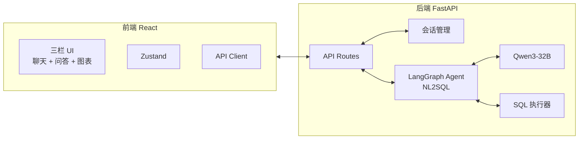

# 智能数据分析系统 - 实施计划

## 技术栈

| 层级 | 技术 |
|------|------|
| 前端 | React 18 + TypeScript + Vite + TailwindCSS + shadcn/ui + ECharts + Zustand |
| 后端 | FastAPI + LangChain + LangGraph + SQLAlchemy |
| LLM | Qwen3-32B（阿里云百炼 DashScope） |
| 数据库 | SQLite3（双库：元数据 + 业务数据） |

---

## 系统架构

---

## Phase 1: 前后端基础框架搭建

**目标：前后端各自能跑起来，接口可调通**

### 后端

| # | 任务 | 文件 |
|---|------|------|
| 1 | 初始化 Python 项目，配置 `pyproject.toml` + `requirements.txt` | `backend/pyproject.toml` |
| 2 | 安装依赖：FastAPI, Uvicorn, LangChain, DashScope, SQLAlchemy 等 | `backend/requirements.txt` |
| 3 | 编写配置：`.env` 模板 + `config.py`（API Key / 库路径 / CORS） | `backend/app/config.py` |
| 4 | 创建 FastAPI 最小骨架，启动验证 | `backend/app/main.py` |
| 5 | 实现 SQLite 元数据库连接 + SQLAlchemy setup | `backend/app/services/db_service.py` |
| 6 | 实现会话 CRUD API（创建/列表/详情/删除/更新标题） | `backend/app/routers/session.py` |
| 7 | 初始化业务数据库脚本 + 示例表（products/orders/customers）+ 示例数据 | `backend/scripts/init_db.py` |
| 8 | 启动 uvicorn，curl 测试所有 CRUD 接口 | 终端验证 |

**交付：uvicorn 启动无报错，所有 API 返回正常数据**

### 前端

| # | 任务 | 文件 |
|---|------|------|
| 1 | 初始化 React + Vite + TypeScript 项目 | `frontend/` |
| 2 | 安装依赖：TailwindCSS, shadcn/ui, ECharts, Zustand, axios | `package.json` |
| 3 | 配置 TailwindCSS + shadcn/ui 基础组件库 | `tailwind.config.ts` |
| 4 | 搭建三栏静态布局骨架（纯 HTML，无业务逻辑） | `frontend/src/components/layout/AppShell.tsx` |
| 5 | 配置 axios API Client（baseURL → `http://localhost:8000`） | `frontend/src/api/client.ts` |
| 6 | 编写 Zustand store 空壳（定义结构，方法 `console.log` 占位） | `frontend/src/stores/useAppStore.ts` |
| 7 | `npm run dev`，浏览器打开 `http://localhost:5173` 验证 | 浏览器验证 |

**交付：三栏布局正确渲染，API 请求不报 CORS 错误**

---

## Phase 2: 前端 UI 开发

**目标：完整的三栏交互界面，mock 数据跑通 UI**

### 左侧 - 会话管理面板

| # | 任务 | 文件 |
|---|------|------|
| 1 | 实现 `SessionList`（遍历 sessions，展示标题+时间） | `frontend/src/components/session/SessionList.tsx` |
| 2 | 实现 `SessionItem`（hover/active 态，新建图标，删除图标） | `frontend/src/components/session/SessionItem.tsx` |
| 3 | "新建会话"按钮 + 点击创建 + 自动切换到新会话 | `SessionList` 内集成 |
| 4 | 点击会话加载历史消息（对接 store action） | `useAppStore.loadSession` |

### 中间 - 问答区域

| # | 任务 | 文件 |
|---|------|------|
| 1 | 实现 `MessageBubble`（用户右对齐+紫色，AI 左对齐+灰玻） | `frontend/src/components/chat/MessageBubble.tsx` |
| 2 | 实现 `SqlBlock`（语法高亮 + 折叠 + 一键复制） | `frontend/src/components/chat/SqlBlock.tsx` |
| 3 | 实现 `ChatInput`（多行 autoResize + 发送按钮 + loading 禁用） | `frontend/src/components/chat/ChatInput.tsx` |
| 4 | 实现 `ChatArea`（消息列表 + 底部固定输入框 + 空状态 + 自动滚动） | `frontend/src/components/chat/ChatArea.tsx` |
| 5 | 流式打字效果（`isStreaming` 逐字追加 content） | `MessageBubble` 内处理 |

### 右侧 - 可视化图表面板

| # | 任务 | 文件 |
|---|------|------|
| 1 | 实现 `ChartSelector`（bar / line / pie / table Tab 切换） | `frontend/src/components/chart/ChartSelector.tsx` |
| 2 | 实现 `ChartRenderer`（ECharts 封装，响应式 resize，4种类型） | `frontend/src/components/chart/ChartRenderer.tsx` |
| 3 | 实现 `DataTable`（列名+数据行，可选分页） | `frontend/src/components/chart/DataTable.tsx` |
| 4 | 实现 `ChartPanel`（整合 selector + renderer + table，空数据时显示空态） | `frontend/src/components/chart/ChartPanel.tsx` |

### 状态管理

| # | 任务 | 文件 |
|---|------|------|
| 1 | 完善 `useAppStore`：所有 action 完整实现（mock 数据） | `frontend/src/stores/useAppStore.ts` |
| 2 | 对接会话 CRUD API（创建/切换/删除） | `frontend/src/api/session.ts` |
| 3 | 对接流式对话 API（fetch 流式） | `frontend/src/api/chat.ts` |

**交付：前端完整 UI 可交互，mock 数据演示流畅，无 console.error**

---

## Phase 3: 后端接口研发

**目标：NL2SQL + 流式响应 + 图表推荐，API 完整可用**

### LLM 接入层

| # | 任务 | 文件 |
|---|------|------|
| 1 | 封装 Qwen3-32B 客户端（流式 + 非流式，`思考模式关闭`） | `backend/app/core/llm.py` |
| 2 | 编写 NL2SQL 提示词模板（schema 注入 + few-shot 示例） | `backend/app/core/prompts.py` |
| 3 | 实现 SQL 安全校验（仅允许 SELECT，防范注入） | `backend/app/core/safety.py` |
| 4 | 手动 curl 验证 Qwen3 能生成正确 SQL | 终端验证 |

### LangGraph Agent

| # | 任务 | 文件 |
|---|------|------|
| 1 | 定义 Nodes：`generate_sql` / `execute_sql` / `explain_result` / `recommend_chart` | `backend/app/agents/nodes.py` |
| 2 | 定义 Edges：条件路由（SQL 失败 → 返回错误；成功 → 继续） | `backend/app/agents/edges.py` |
| 3 | 组装 LangGraph，暴露 `run_agent(query, session_id)` | `backend/app/agents/graph.py` |

### 对话 API

| # | 任务 | 文件 |
|---|------|------|
| 1 | 实现 SSE 流式接口 `GET /api/sessions/{id}/stream` | `backend/app/routers/chat.py` |
| 2 | 上下文记忆（历史消息 + schema 注入 LLM） | `backend/app/services/session_service.py` |
| 3 | Schema 查询接口 `GET /api/schema` | `backend/app/routers/schema.py` |
| 4 | 直接执行 SQL 接口（调试用）`POST /api/query/execute` | `backend/app/routers/query.py` |

### 会话服务完善

| # | 任务 | 文件 |
|---|------|------|
| 1 | 消息持久化：SQLite 存 messages 表（role/content/sql/chart_data） | `backend/app/models/message.py` |
| 2 | 自动生成会话标题（取第一条用户消息前 20 字） | `backend/app/services/session_service.py` |
| 3 | 上下文裁剪（超过最大 tokens 时截断旧消息） | `backend/app/services/session_service.py` |

**交付：后端独立验证通过，发自然语言 → 流式返回 SQL + 结果 + 图表推荐**

---

## Phase 4: 前后端联调

**目标：端到端跑通，上线可用**

### 联调清单

| # | 任务 | 验证方式 |
|---|------|----------|
| 1 | 前端发消息 → 后端 SSE 流式 → 前端打字渲染 | 浏览器观察 |
| 2 | 后端返回 SQL → 前端 `SqlBlock` 折叠展示 + 复制 | 页面验证 |
| 3 | 后端返回 `chartData` → 前端 ECharts 正确渲染 | 图表展示 |
| 4 | 图表类型切换（bar/line/pie/table） | 点击验证 |
| 5 | 新建会话 → 切换会话 → 历史消息加载 | 页面验证 |
| 6 | 删除会话 | 页面验证 |
| 7 | 错误边界（LLM 超时 / SQL 执行失败 / 网络断连） | 边界测试 |
| 8 | CORS 确认（前端 `5173` → 后端 `8000`） | 浏览器无报错 |

### 收尾

| # | 任务 |
|---|------|
| 1 | 编写 `README.md`（环境变量 + 启动命令 + 使用说明） |
| 2 | 全局检查无 `console.error` |
| 3 | `git init` / `git add` / 首次提交 |

**交付：完整可用的智能数据分析系统，提交 GitHub**

---

## 4 阶段总览

| Phase | 重点 | 后端 | 前端 | 交付 |
|-------|------|------|------|------|
| **1** | 框架搭建 | CRUD 可用，数据库初始化 | 空白三栏骨架 | 能跑起来 |
| **2** | 前端 UI | 不动 | 完整 UI，mock 数据 | 交互界面完整 |
| **3** | 后端接口 | NL2SQL + 流式 + 图表推荐 | 不动 | API 完整可用 |
| **4** | 联调上线 | 对接调试 | 对接调试 | 端到端可用 |
