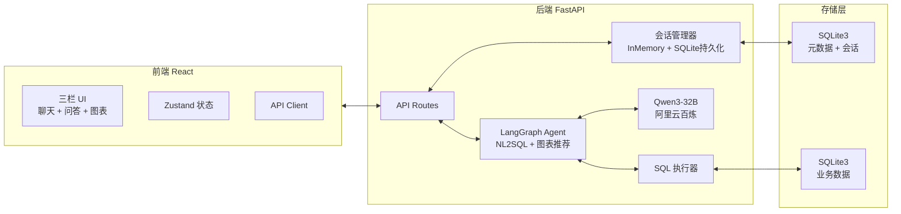

# 智能数据分析系统 v2 - 模块规划

## 一、技术选型与架构

### 1.1 核心技术栈

| 层级 | 技术选型 | 说明 |
|------|----------|------|
| **前端框架** | React 18 + TypeScript |  |
| **构建工具** | Vite |  |
| **状态管理** | Zustand | 轻量、够用 |
| **图表库** | ECharts | 功能丰富 |
| **UI 组件** | shadcn/ui + TailwindCSS | 基于 Radix，可定制 |
| **后端框架** | FastAPI | 高性能异步 |
| **LLM 集成** | LangChain + LangGraph | Agent 架构 |
| **LLM 模型** | Qwen3-32B（阿里云百炼） | 32K 上下文 |
| **数据库** | SQLite3 | 轻量、易部署 |
| **ORM** | SQLAlchemy 2.0 | 类型安全 |
| **向量存储** | 可选 later | 前期不需要 |

### 1.2 系统架构



---

## 二、项目目录结构

```
VibeCoding/
│
├── backend/                         # 后端
│   ├── app/
│   │   ├── __init__.py
│   │   ├── main.py                 # FastAPI 入口
│   │   ├── config.py               # 配置（环境变量）
│   │   │
│   │   ├── routers/                # API 路由
│   │   │   ├── __init__.py
│   │   │   ├── session.py          # 会话 CRUD
│   │   │   ├── chat.py             # 对话 / 流式响应
│   │   │   ├── schema.py           # 数据库 schema
│   │   │   └── query.py            # 直接执行 SQL
│   │   │
│   │   ├── core/
│   │   │   ├── __init__.py
│   │   │   ├── llm.py              # Qwen3 客户端封装
│   │   │   ├── prompts.py          # 提示词模板
│   │   │   └── safety.py           # SQL 安全校验
│   │   │
│   │   ├── agents/
│   │   │   ├── __init__.py
│   │   │   ├── graph.py            # LangGraph 定义
│   │   │   ├── nodes.py            # Graph Nodes
│   │   │   ├── edges.py            # Graph Edges
│   │   │   └── tools.py            # Tool definitions
│   │   │
│   │   ├── services/
│   │   │   ├── __init__.py
│   │   │   ├── session_service.py  # 会话管理
│   │   │   └── db_service.py       # 数据库操作
│   │   │
│   │   ├── models/
│   │   │   ├── __init__.py
│   │   │   ├── session.py          # 会话模型
│   │   │   └── message.py          # 消息模型
│   │   │
│   │   └── schemas/
│   │       ├── __init__.py
│   │       ├── session.py
│   │       └── chat.py
│   │
│   ├── data/                       # 数据库文件
│   │   ├── meta.db                 # 元数据（会话）
│   │   └── sample.db               # 业务数据（示例）
│   │
│   ├── scripts/
│   │   └── init_db.py              # 数据库初始化 + 示例数据
│   │
│   ├── requirements.txt
│   └── pyproject.toml
│
├── frontend/                        # 前端
│   ├── src/
│   │   ├── components/
│   │   │   ├── layout/
│   │   │   │   ├── AppShell.tsx    # 三栏容器
│   │   │   │   └── ResizablePanels.tsx  # 可调宽度面板
│   │   │   │
│   │   │   ├── session/
│   │   │   │   ├── SessionList.tsx  # 左侧会话列表
│   │   │   │   └── SessionItem.tsx   # 单个会话
│   │   │   │
│   │   │   ├── chat/
│   │   │   │   ├── ChatArea.tsx    # 中间问答区
│   │   │   │   ├── MessageBubble.tsx # 消息气泡
│   │   │   │   ├── SqlBlock.tsx     # SQL 代码块
│   │   │   │   └── ChatInput.tsx    # 输入框
│   │   │   │
│   │   │   └── chart/
│   │   │       ├── ChartPanel.tsx   # 右侧图表面板
│   │   │       ├── ChartRenderer.tsx # ECharts 封装
│   │   │       └── ChartSelector.tsx # 图表类型切换
│   │   │
│   │   ├── stores/
│   │   │   └── useAppStore.ts      # Zustand store
│   │   │
│   │   ├── api/
│   │   │   ├── client.ts           # axios 实例
│   │   │   ├── session.ts          # 会话 API
│   │   │   └── chat.ts             # 对话 API
│   │   │
│   │   ├── types/
│   │   │   └── index.ts            # 全局类型
│   │   │
│   │   ├── App.tsx
│   │   └── main.tsx
│   │
│   ├── package.json
│   ├── vite.config.ts
│   └── tsconfig.json
│
└── README.md
```

---

## 三、后端核心模块

### 3.1 LangGraph Agent 设计

```
┌─────────────────────────────────────────────────────┐
│                    User Query                        │
└─────────────────────────┬───────────────────────────┘
                          ▼
               ┌──────────────────────┐
               │  Intent Recognition  │  ← 识别查询/统计/分析意图
               └──────────┬───────────┘
                          ▼
         ┌────────────────────────────────┐
         │  Schema Retrieval (if needed)  │  ← 注入数据库 schema
         └──────────────┬─────────────────┘
                         ▼
              ┌───────────────────────┐
              │   SQL Generation Node  │  ← Qwen3-32B 生成 SQL
              └───────────┬────────────┘
                          ▼
              ┌───────────────────────┐
              │   SQL Safety Check    │  ← 校验：只允许 SELECT
              └───────────┬────────────┘
                          ▼
              ┌───────────────────────┐
              │   SQL Execution Node  │  ← 执行查询
              └───────────┬────────────┘
                          ▼
              ┌───────────────────────┐
              │  Result + Explanation  │  ← 自然语言解释结果
              └───────────┬────────────┘
                          ▼
              ┌───────────────────────┐
              │  Chart Recommendation  │  ← 智能推荐图表类型
              └───────────┬────────────┘
                          ▼
               ┌──────────────────────┐
               │    Final Response    │  ← 包含 SQL + 图表配置
               └──────────────────────┘
```

### 3.2 会话管理设计

```python
# 会话数据模型（SQLite 持久化）
class Session:
    id: str              # UUID
    title: str           # 自动从第一条消息生成
    created_at: datetime
    updated_at: datetime

class Message:
    id: str
    session_id: str      # 外键
    role: str            # "user" | "assistant"
    content: str         # 自然语言回答
    sql: str | None      # 生成的 SQL
    chart_type: str | None  # 图表类型
    chart_data: dict | None # 图表数据
    raw_result: list | None # 原始查询结果
    created_at: datetime
```

### 3.3 API 端点设计

| 端点 | 方法 | 功能 |
|------|------|------|
| `POST /api/sessions` | POST | 创建会话 |
| `GET /api/sessions` | GET | 获取会话列表 |
| `GET /api/sessions/{id}` | GET | 获取会话（含消息） |
| `DELETE /api/sessions/{id}` | DELETE | 删除会话 |
| `PATCH /api/sessions/{id}` | PATCH | 更新会话标题 |
| `POST /api/sessions/{id}/messages` | POST | 发送消息（返回流式） |
| `GET /api/sessions/{id}/stream` | GET | SSE 流式对话 |
| `GET /api/schema` | GET | 获取数据库 schema |
| `POST /api/query/execute` | POST | 直接执行 SQL（调试用） |

---

## 四、前端核心模块

### 4.1 三栏布局

```
┌────────────────┬───────────────────────────────┬──────────────────┐
│   会话管理      │         问答区域               │    可视化图表      │
│   (280px)     │      (flex: 1, min 400px)      │    (400px)       │
│               │                                │                  │
│ [+ 新建会话]   │  AI: 请输入您的查询...           │  图表类型: 柱状图  │
│               │                                │                  │
│ ○ 会话 1      │  User: 上个月的销售情况如何？     │  ┌────────────┐  │
│   今天 14:30  │                                │  │   📊       │  │
│               │  AI: 根据查询结果，上个月销售额    │  │  ECharts  │  │
│ ● 会话 2 ←当前 │  为 ¥125,800，环比增长 12%。    │  │   Chart   │  │
│   今天 10:20  │                                │  └────────────┘  │
│               │  ```sql                        │                  │
│ ○ 会话 3      │  SELECT ...                    │  数据表格        │
│   昨天 18:00  │  ```                           │                  │
│               │                                │                  │
│               │  ┌────────────────────────┐   │                  │
│               │  │ 输入问题...        ▶  │   │                  │
│               │  └────────────────────────┘   │                  │
└───────────────┴───────────────────────────────┴──────────────────┘
```

### 4.2 Zustand Store 结构

```typescript
interface AppStore {
  // 会话
  sessions: Session[];
  currentSessionId: string | null;

  // 消息
  messages: Message[];
  isStreaming: boolean;

  // 图表
  currentChart: ChartData | null;
  chartType: 'bar' | 'line' | 'pie' | 'table';

  // Schema
  dbSchema: TableSchema[];

  // Actions
  createSession: () => Promise<void>;
  loadSession: (id: string) => Promise<void>;
  sendMessage: (content: string) => Promise<void>;
  fetchSchema: () => Promise<void>;
}
```

### 4.3 消息气泡设计

```tsx
// 用户消息：右对齐，深紫色背景
// AI 消息：左对齐，深灰背景 + 玻璃效果

MessageBubble {
  content: string        // 自然语言回答
  sql?: string           // 可折叠的 SQL 块
  chartData?: ChartData  // 内嵌小图表
  isStreaming?: boolean  // 流式打字效果
}
```

---

## 五、数据库初始化

### 5.1 示例业务数据库（sample.db）

```sql
-- 初始化示例数据：销售数据分析场景

CREATE TABLE products (
    id INTEGER PRIMARY KEY,
    name TEXT NOT NULL,
    category TEXT NOT NULL,
    price REAL NOT NULL
);

CREATE TABLE orders (
    id INTEGER PRIMARY KEY,
    product_id INTEGER REFERENCES products(id),
    quantity INTEGER NOT NULL,
    total_amount REAL NOT NULL,
    order_date TEXT NOT NULL,
    customer_region TEXT NOT NULL
);

CREATE TABLE customers (
    id INTEGER PRIMARY KEY,
    name TEXT NOT NULL,
    region TEXT NOT NULL,
    join_date TEXT NOT NULL
);

-- 插入示例数据...
```

---

## 六、实施顺序（4 阶段）

### Phase 1: 前后端基础框架搭建 + 跑通测试（目标：能跑起来）

#### 后端工作

| # | 任务 | 关键文件 |
|---|------|----------|
| 1 | 初始化 Python 项目，配置 `pyproject.toml` + `requirements.txt` | `backend/pyproject.toml` |
| 2 | 安装依赖：FastAPI, Uvicorn, LangChain, DashScope, SQLAlchemy 等 | `backend/requirements.txt` |
| 3 | 编写配置模块 `.env` 模板 + `config.py`（API Key / 数据库路径 / CORS） | `backend/app/config.py` |
| 4 | 创建 FastAPI 最小骨架 + 启动验证 | `backend/app/main.py` |
| 5 | 实现 SQLite 元数据库连接 + SQLAlchemy setup | `backend/app/services/db_service.py` |
| 6 | 实现会话 CRUD API（创建/列表/详情/删除/更新标题） | `backend/app/routers/session.py` |
| 7 | 初始化业务数据库脚本 + 示例表（products/orders/customers）+ 示例数据 | `backend/scripts/init_db.py` |
| 8 | 手动验证后端 API（启动 uvicorn，curl 测试 CRUD） | `curl` |

#### 前端工作

| # | 任务 | 关键文件 |
|---|------|----------|
| 1 | 初始化 React + Vite + TypeScript 项目 | `frontend/` |
| 2 | 安装依赖：TailwindCSS, shadcn/ui, ECharts, Zustand, axios | `package.json` |
| 3 | 配置 TailwindCSS + shadcn/ui 基础组件库 | `tailwind.config.ts`, `components.json` |
| 4 | 搭建三栏布局骨架（纯静态 HTML，不含业务逻辑） | `frontend/src/components/layout/AppShell.tsx` |
| 5 | 配置 axios API Client（baseURL 指向后端 `http://localhost:8000`） | `frontend/src/api/client.ts` |
| 6 | 编写 Zustand store 空壳（定义结构，方法先写 `console.log` 占位） | `frontend/src/stores/useAppStore.ts` |
| 7 | 验证前端能跑（`npm run dev`，浏览器打开 `http://localhost:5173`） | 浏览器验证 |

#### 阶段交付

- 后端：`uvicorn` 启动无报错，CRUD 接口返回正常数据
- 前端：三栏布局渲染正确，API 能请求到后端（跨域不报错）
- 两边都能独立运行，无报错

---

### Phase 2: 前端 UI 开发（目标：完整的三栏交互界面）

#### 左侧 - 会话管理面板

| # | 任务 | 关键文件 |
|---|------|----------|
| 1 | 实现会话列表 `SessionList`（遍历 sessions，展示标题+时间） | `frontend/src/components/session/SessionList.tsx` |
| 2 | 实现会话项 `SessionItem`（hover/active 状态，新建图标，删除图标） | `frontend/src/components/session/SessionItem.tsx` |
| 3 | 实现"新建会话"按钮 + 点击创建 + 自动切换 | `SessionList` 内集成 |
| 4 | 实现点击会话切换（加载历史消息） | `useAppStore.loadSession` |

#### 中间 - 问答区域

| # | 任务 | 关键文件 |
|---|------|----------|
| 1 | 实现消息气泡 `MessageBubble`（用户右对齐+紫色，AI左对齐+灰玻） | `frontend/src/components/chat/MessageBubble.tsx` |
| 2 | 实现 SQL 代码块 `SqlBlock`（语法高亮 + 折叠 + 一键复制） | `frontend/src/components/chat/SqlBlock.tsx` |
| 3 | 实现输入框 `ChatInput`（多行 autoResize + 发送按钮 + loading 态禁用） | `frontend/src/components/chat/ChatInput.tsx` |
| 4 | 实现聊天区 `ChatArea`（消息列表 + 底部固定输入框 + 空状态提示 + 自动滚动） | `frontend/src/components/chat/ChatArea.tsx` |
| 5 | 实现流式打字效果（`isStreaming` 状态逐字追加 content） | `MessageBubble` 内处理 |

#### 右侧 - 可视化图表面板

| # | 任务 | 关键文件 |
|---|------|----------|
| 1 | 实现图表选择器 `ChartSelector`（bar / line / pie / table 切换 Tab） | `frontend/src/components/chart/ChartSelector.tsx` |
| 2 | 实现 ECharts 封装 `ChartRenderer`（响应式 resize，支持4种类型） | `frontend/src/components/chart/ChartRenderer.tsx` |
| 3 | 实现数据表格 `DataTable`（列名+数据行，分页可选） | `frontend/src/components/chart/DataTable.tsx` |
| 4 | 实现图表面板 `ChartPanel`（整合 selector + renderer + table，无数据时显示空态） | `frontend/src/components/chart/ChartPanel.tsx` |

#### 状态管理完善

| # | 任务 | 关键文件 |
|---|------|----------|
| 1 | 完善 `useAppStore`：完整实现所有 action（mock 数据先跑通 UI） | `frontend/src/stores/useAppStore.ts` |
| 2 | 对接会话 CRUD API（创建/切换/删除） | `frontend/src/api/session.ts` |
| 3 | 对接流式对话 API（EventSource 或 fetch 流式） | `frontend/src/api/chat.ts` |

#### 阶段交付

- 前端完整 UI 可交互（不含后端时用 mock 数据演示）
- 三栏之间状态联动正常，切换会话/图表类型均正常
- 无 console.error，设计风格统一

---

### Phase 3: 后端接口研发（目标：完整的 NL2SQL + 会话 + 图表推荐）

#### 3.1 LLM 接入层

| # | 任务 | 关键文件 |
|---|------|----------|
| 1 | 封装 Qwen3-32B 客户端（流式 + 非流式，`思考模式关闭`） | `backend/app/core/llm.py` |
| 2 | 编写 NL2SQL 提示词模板（schema 注入 + few-shot 示例） | `backend/app/core/prompts.py` |
| 3 | 实现 SQL 安全校验（仅允许 SELECT，防范注入） | `backend/app/core/safety.py` |
| 4 | 手动 curl 验证 Qwen3 响应（确认能生成 SQL） |  |

#### 3.2 LangGraph Agent

| # | 任务 | 关键文件 |
|---|------|----------|
| 1 | 定义 Graph Nodes：`generate_sql` / `execute_sql` / `explain_result` / `recommend_chart` | `backend/app/agents/nodes.py` |
| 2 | 定义 Graph Edges：条件路由（SQL 校验失败 → 返回错误；成功 → 继续） | `backend/app/agents/edges.py` |
| 3 | 组装 LangGraph，暴露 `run_agent(query, session_id)` 方法 | `backend/app/agents/graph.py` |

#### 3.3 对话 API

| # | 任务 | 关键文件 |
|---|------|----------|
| 1 | 实现 SSE 流式对话接口 `GET /api/sessions/{id}/stream`（每次 query 实时推送） | `backend/app/routers/chat.py` |
| 2 | 实现上下文记忆（注入历史消息 + schema 到 LLM） | `session_service.py` |
| 3 | 实现 Schema 查询接口 `GET /api/schema`（返回所有表名+字段+类型） | `backend/app/routers/schema.py` |
| 4 | 实现直接执行 SQL 接口（调试用） | `backend/app/routers/query.py` |

#### 3.4 会话服务完善

| # | 任务 | 关键文件 |
|---|------|----------|
| 1 | 消息持久化：SQLite 存储 messages 表（role/content/sql/chart_data） | `backend/app/models/message.py` |
| 2 | 自动生成会话标题（取第一条用户消息前 20 字） | `session_service.py` |
| 3 | 上下文裁剪（超过最大 tokens 时截断旧消息） | `session_service.py` |

#### 阶段交付

- 后端可独立验证：发自然语言 → 流式返回 SQL + 结果 + 图表推荐
- 所有 API 接口可用，无报错

---

### Phase 4: 前后端联调（目标：端到端跑通）

#### 联调清单

| # | 任务 | 验证方式 |
|---|------|----------|
| 1 | 前端发消息 → 后端 SSE 流式 → 前端打字渲染 | 浏览器观察 |
| 2 | 后端返回 SQL → 前端 `SqlBlock` 折叠展示 + 复制 | 页面验证 |
| 3 | 后端返回 `chartData` → 前端 ECharts 正确渲染 | 图表展示 |
| 4 | 图表类型切换（bar/line/pie/table） | 点击验证 |
| 5 | 新建会话 → 切换会话 → 历史消息加载 | 页面验证 |
| 6 | 删除会话 | 页面验证 |
| 7 | 错误边界（LLM 超时 / SQL 执行失败 / 网络断连） | 边界测试 |
| 8 | CORS 配置确认（前端 `5173` → 后端 `8000`） | 浏览器无 CORS 报错 |

#### 收尾

| # | 任务 |
|---|------|
| 1 | 编写 `README.md`（环境变量说明 + 启动命令 + 使用说明） |
| 2 | 全局检查无 `console.error` |
| 3 | `git init` / `git add` / 首次提交 |

---

## 七、4 阶段总览

| Phase | 重点 | 后端状态 | 前端状态 | 交付物 |
|-------|------|----------|----------|--------|
| **Phase 1** | 框架搭建 + 跑通 | CRUD 可用，数据库初始化 | 空白三栏骨架 | 能跑起来 |
| **Phase 2** | 前端 UI 开发 | 不动 | 完整 UI，mock 数据 | 交互界面完整 |
| **Phase 3** | 后端接口研发 | NL2SQL + 流式 + 图表推荐 | 不动 | API 完整可用 |
| **Phase 4** | 前后端联调 | 对接调试 | 对接调试 | 端到端可用 |

---

## 七、关键实现细节

### 7.1 Qwen3-32B 调用方式

```python
# backend/app/core/llm.py
from openai import OpenAI

client = OpenAI(
    api_key=os.getenv("DASHSCOPE_API_KEY"),
    base_url="https://dashscope.aliyuncs.com/compatible-mode/v1",
)

def chat(messages: list[dict], stream: bool = True):
    return client.chat.completions.create(
        model="qwen3-32b",
        messages=messages,
        stream=stream,
        temperature=0.3,
    )
```

### 7.2 NL2SQL 提示词策略

```python
# 使用 Qwen3 的 thinking 模式关闭，获得更稳定的 SQL
# 提供完整的 schema + few-shot 示例
# 在工具调用（tool_call）模式下使用

SYSTEM_PROMPT = """
你是一个 SQL 专家。用户会用自然语言提问，你需要生成对应的 SQL 查询。

数据库 schema:
{schema}

规则:
1. 只生成 SELECT 语句，禁止 INSERT/UPDATE/DELETE/DROP
2. 使用 SQLite 语法
3. 结果返回 JSON 格式: {{"sql": "...", "explanation": "..."}}
4. 如果无法回答，说明原因
"""
```

### 7.3 前端现代 UI 风格

```css
/* 暗色主题主色调 */
--bg-primary: #0f0f23;      /* 深空蓝黑 */
--bg-secondary: #1a1a2e;    /* 面板背景 */
--bg-tertiary: #16213e;     /* 卡片背景 */
--accent-primary: #7c3aed;  /* 紫色主色 */
--accent-secondary: #06b6d4; /* 青色辅色 */
--text-primary: #f1f5f9;
--text-secondary: #94a3b8;
--border: rgba(255, 255, 255, 0.08);

/* 玻璃效果 */
background: rgba(26, 26, 46, 0.8);
backdrop-filter: blur(12px);
border: 1px solid var(--border);
```